# LifeCOM 智慧營運系統 — 完整規劃與實作計畫

> 版本：v2.0-dev | 建立：2026-03-03 | 更新：2026-03-07 | 作者：AI Agent
> v1.0-stable tag 已建立（安全還原點）
> v2.0：加入 C-04 通訊事件智慧層（碎片→事件→主題→洞察四層架構）
> 開發分支：feature/c04-comm-intelligence | 相容性：現有日報/cron/sync 不中斷
> 
> 目標：以 AI Agent 作為 CEO 智慧作業系統，整合所有營運資料，實現「資料驅動決策」的 SaaS 公司管理。

---

## 一、現況資料盤點

### 1.1 資料源總覽

```mermaid
graph TB
    subgraph 財務
        A[立富康發票 xlsx<br/>月度應收/MoM/YoY]
        B[業務文件.xlsx<br/>客戶應收催收]
        C[Notion 尚未到款項<br/>快速記帳]
    end
    subgraph 業務
        D[業務文件.xlsx<br/>報價單 Quote]
        E[業務文件.xlsx<br/>需求單 Feature]
        F[報價單追蹤 Sheets]
    end
    subgraph 客戶
        G[業務文件.xlsx<br/>客戶基本資料 57家]
        H[業務文件.xlsx<br/>客戶使用產品]
        I[Notion 客戶總覽]
        J[Notion 授權進度]
    end
    subgraph 工程
        K[ADO Feature<br/>~100項專案]
        L[ADO Epic<br/>維運工單 33客戶]
        M[ADO Bug<br/>工單追蹤]
    end
    subgraph 維運
        N[Slack 系統告警]
        O[Slack 部署頻道]
        P[Notion CSM/OP費用]
    end

    A --> CEO日報
    B --> CEO日報
    D --> CEO日報
    G --> CEO日報
    K --> CEO日報
    N --> CEO日報
```

### 1.2 現況關鍵數字

| 維度 | 數值 | 備註 |
|------|------|------|
| 客戶數 | 57 家 | 業務文件 + Notion |
| 月經常性收入 | NT$1,578,732 | 2026/03，YoY ▲2.9% |
| Q1 累計收入 | NT$4,766,116 | YoY ▲10.8% |
| 未回簽報價 | 11 筆 ≈ NT$536,400+ | 待業務跟進 |
| 未收款項 | NT$244,614+ | Notion 記錄（需確認是否過時）|
| ADO 逾期專案 | 20+ 項 🔴 | Feature 最久逾期 355 天 |
| 維運工單積壓 | 33 客戶全紅 | 帳齡最久 371 天 |
| API 授權過期 | 3 家 | JS/鼎恆/Swarovski Yahoo API |

### 1.3 產品結構

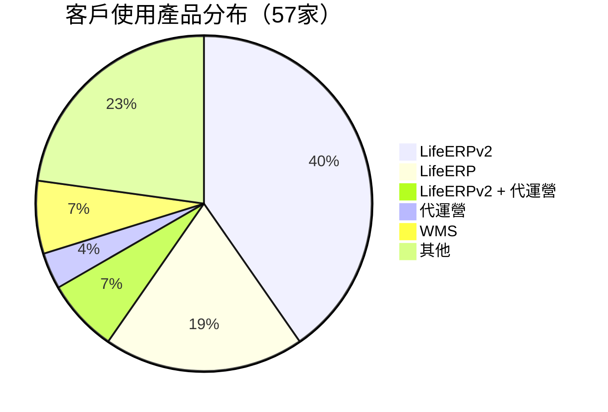

---

## 二、問題診斷

### 2.1 財務風險

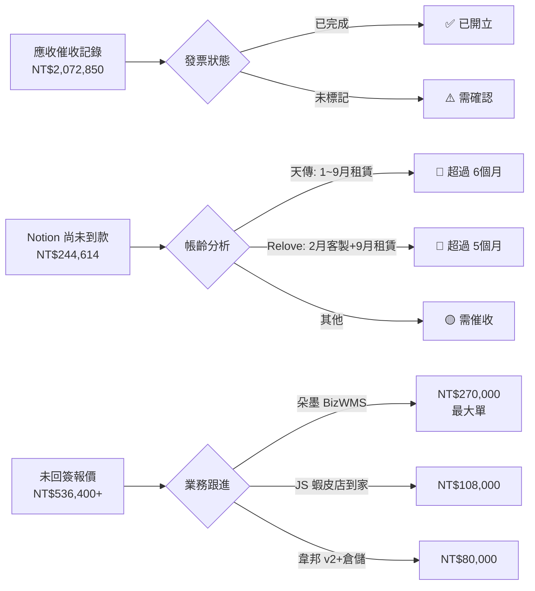

### 2.2 工程交付風險

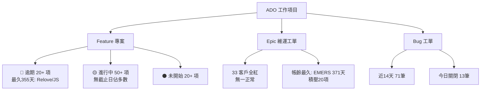

### 2.3 客戶風險矩陣

| 風險等級 | 客戶 | 問題 |
|---------|------|------|
| 🔴 高 | EMERS | 維運積壓20項、API授權未更新、Momo告警持續 |
| 🔴 高 | Loreal | 4個逾期 Feature、MarsId重複、LineGift問題 |
| 🔴 高 | 天傳 | 1~9月租賃未收款（超過6個月）|
| 🔴 高 | Relove | 2月客製+9月租賃未收款、Feature逾期355天 |
| 🟡 中 | JS | Yahoo API 過期381天、報價未回簽 NT$108K+NT$36K |
| 🟡 中 | 鼎恆 | Yahoo API 過期312天、91APP串接報價未回簽 |
| 🟡 中 | Swarovski | Yahoo API 過期302天 |

---

## 三、模組規劃

### 3.1 模組架構

```mermaid
graph TB
    CEO[CEO 智慧作業系統]
    
    CEO --> F[💰 財務模組]
    CEO --> C[👥 客戶模組]
    CEO --> S[📈 業務模組]
    CEO --> E[⚙️ 工程模組]
    CEO --> H[👤 人資模組]
    CEO --> R[📊 報告模組]

    F --> F1[F-01 應收帳款追蹤]
    F --> F2[F-02 現金流預測]
    F --> F3[F-03 P&L 月報]
    F --> F4[F-04 費用管控]

    C --> C1[C-01 客戶健康儀表板]
    C --> C2[C-02 授權到期追蹤]
    C --> C3[C-03 合約管理]
    C --> C4[C-04 LINE 對話擷取與分析]

    S --> S1[S-01 銷售管道追蹤]
    S --> S2[S-02 報價催簽]
    S --> S3[S-03 客戶擴充機會]

    E --> E1[E-01 工程 KPI]
    E --> E2[E-02 技術債看板]
    E --> E3[E-03 系統可用性]

    H --> H1[H-01 工程師負載]
    H --> H2[H-02 人員資料整合]

    R --> R1[CEO 日報]
    R --> R2[CTO 日報]
    R --> R3[月度策略報告]
```

### 3.2 資料流設計

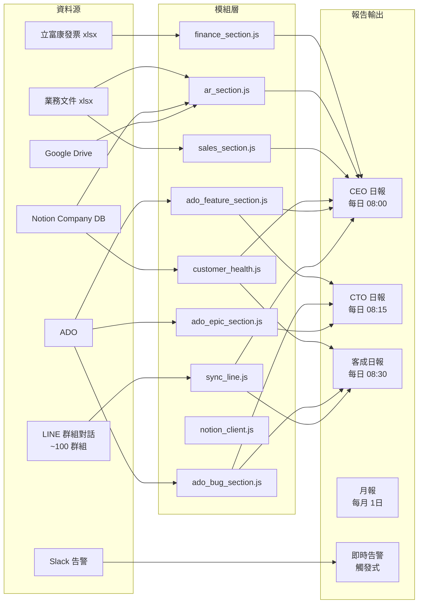

---

## 四、實作計畫

### Phase 1：財務 + 業務可視化（本週，3/3–3/7）

#### F-01 應收帳款模組

**資料源**：業務文件.xlsx → 客戶應收催收 工作表

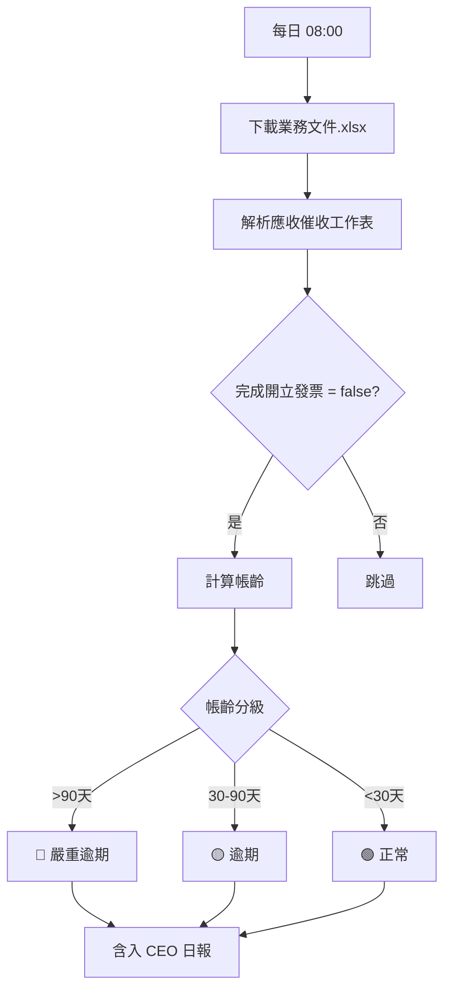

**實作**：`scripts/ar_section.js`（`generate({ format: 'ceo' })`）

---

#### S-01 銷售管道模組

**資料源**：業務文件.xlsx → 報價單Quote 工作表

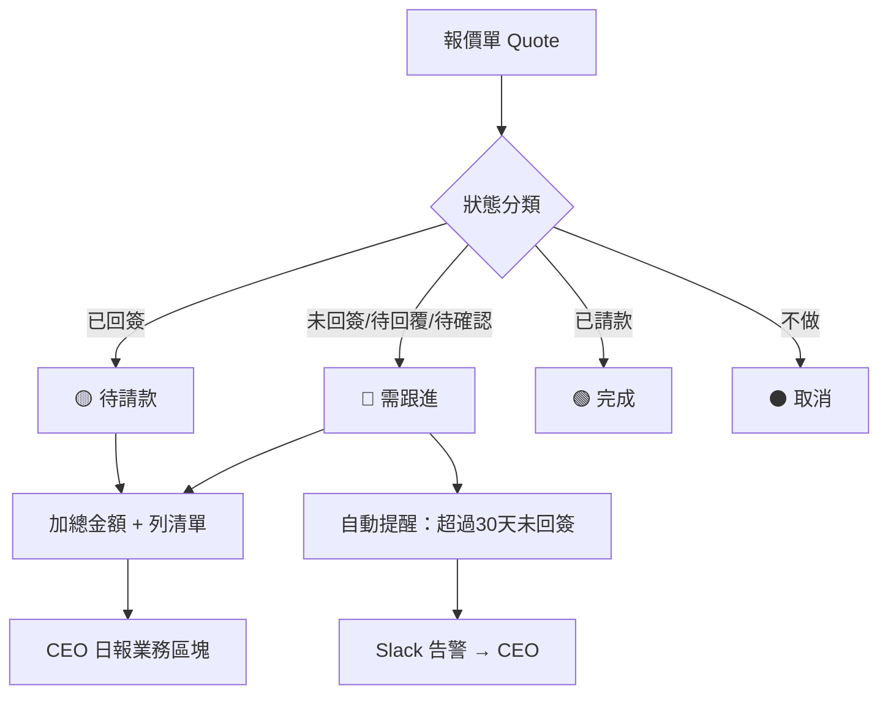

**實作**：`scripts/sales_section.js`

---

#### C-01 客戶健康儀表板

**資料源**：ADO Epic/Bug × Notion 授權進度 × 業務文件 AR

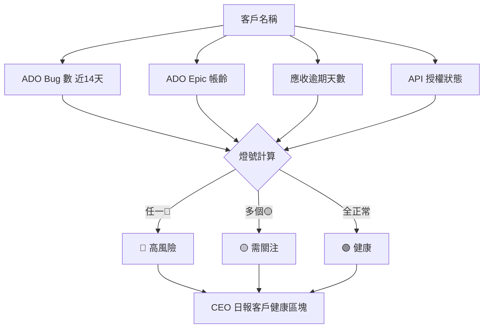

---

#### C-02 授權到期提醒

**資料源**：Notion 授權進度 DB

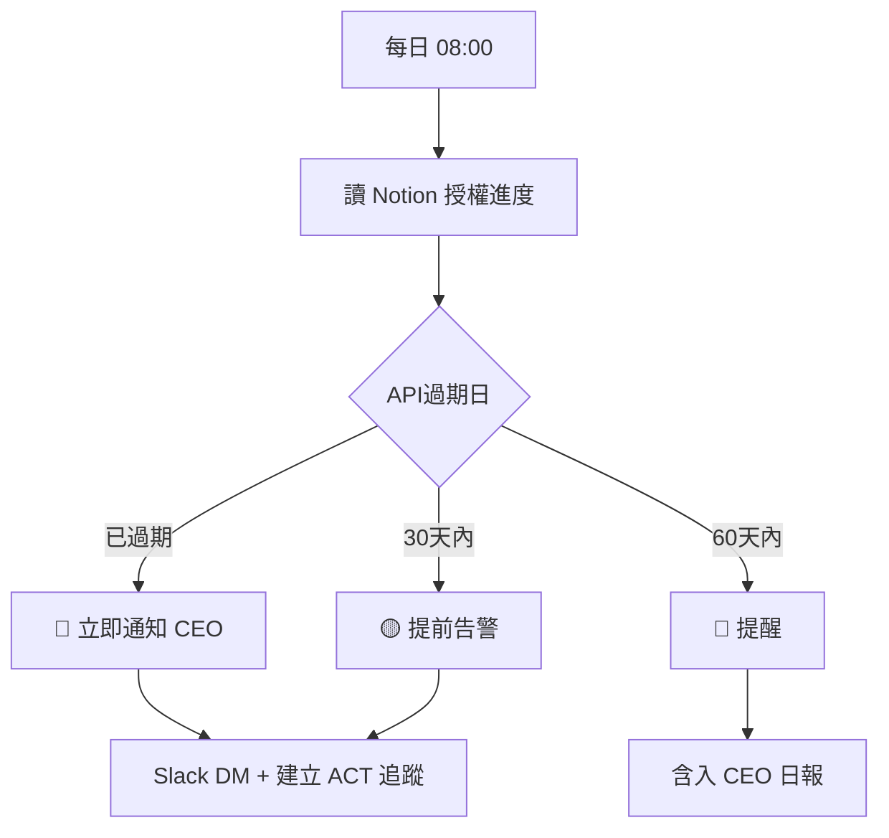

**立刻處理**：JS / 鼎恆 / Swarovski Yahoo API 已過期超過 300 天

---

#### D-01 上板部署 Email 通知

**資料源**：Slack 部署頻道（C03FSJ3PQKD）

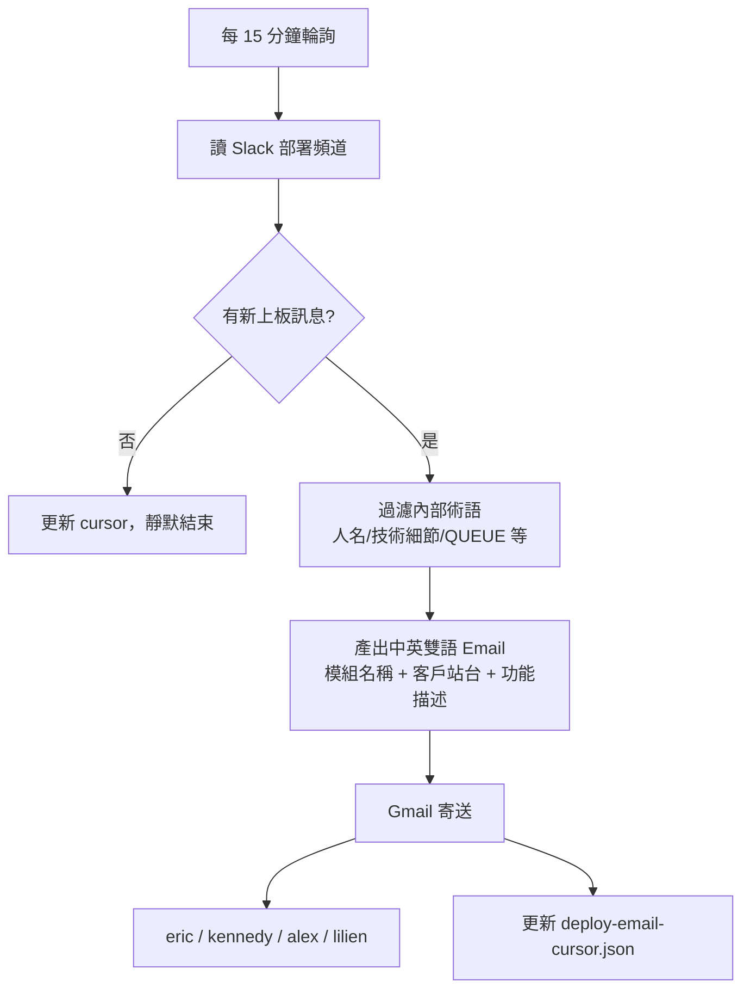

**收件人**：eric@lifecom.com.tw、kennedy@licodes.net、alex@lifecom.com.tw、lilien.lu2@licodes.net

**觸發關鍵字**：Merged、OMS-Release、開始進行+Release、上板部署

**實作**：cron systemEvent，每 15 分鐘，`data/deploy-email-cursor.json` 追蹤 lastTs

---

### Phase 2：工程效能 + 客戶深度（下週，3/10–3/14）

#### E-01 工程 KPI 週報

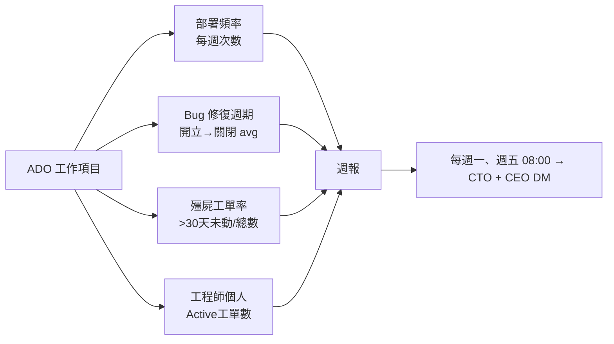

#### E-02 技術債看板

| 指標 | 計算方式 | 觸發條件 |
|------|---------|---------|
| 帳齡 > 90 天 Epic | ADO Epic 過濾 | 每月報告 |
| 殭屍工單率 | >30天未更新 / 總工單 | >50% 告警 |
| 客戶專屬風險 | 單一工程師熟悉度 | bus factor=1 告警 |

---

### C-04 通訊事件智慧層 Communication Intelligence（3/10–3/28）

> 決策日：2026-03-07，Eric 核准。
> 核心概念：**碎片 → 事件 → 主題 → 洞察**，四層萃取。

**問題**：CEO 每天被上百條碎片資訊淹沒（LINE 群組、Slack 頻道、Email），90% 是 noise，但裡面藏著客戶不滿的早期訊號、承諾未兌現、問題反覆出現的模式。現在這些碎片散落各處，無法搜尋、無法關聯、無法追蹤。

**設計哲學**：不是「儲存」問題，是「萃取」問題。存了一堆原始訊息 CEO 不會去翻。真正的價值在於從碎片中萃取出可行動的「事件」。

#### 四層架構

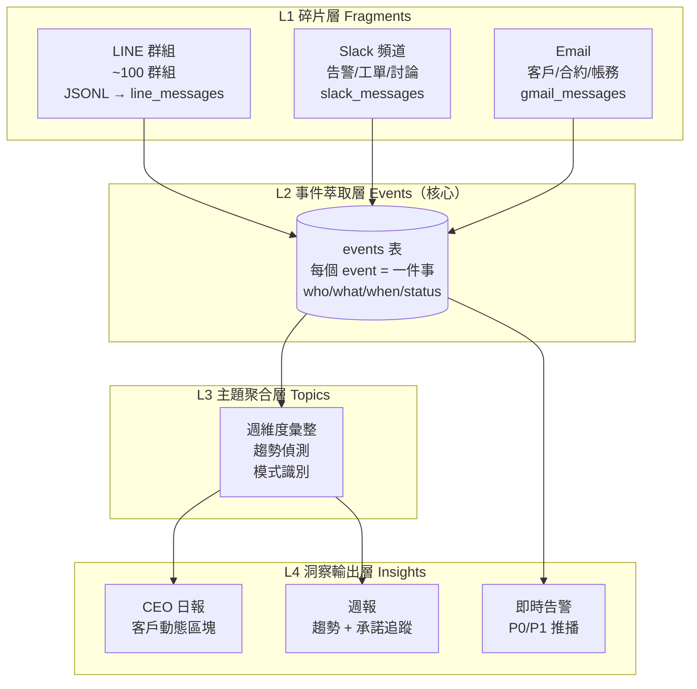

#### L1 碎片層 — Schema

碎片層負責「保存」，不做判斷。各渠道分開存，結構不同：

```sql
-- LINE 訊息（新建）
CREATE TABLE line_messages (
  msg_id TEXT PRIMARY KEY,
  group_id TEXT NOT NULL,
  sender_id TEXT NOT NULL,
  sender_name TEXT,
  content TEXT,
  media_type TEXT,
  ts INTEGER NOT NULL,
  session_key TEXT,
  indexed_at INTEGER DEFAULT (strftime('%s','now'))
);

-- LINE 群組對照（新建）
CREATE TABLE line_groups (
  group_id TEXT PRIMARY KEY,
  group_name TEXT,
  customer_tag TEXT,
  category TEXT,              -- customer / internal / vendor
  active INTEGER DEFAULT 1
);

-- Slack 訊息（已有 slack_messages）
-- Email（已有 gmail_messages）

-- 分析時的統一視圖
CREATE VIEW channel_messages_unified AS
SELECT 'line' as channel, group_id as channel_id, sender_id,
       sender_name, content as text, ts, NULL as thread_ts
FROM line_messages
UNION ALL
SELECT 'slack', channel_id, user_id,
       NULL, text, CAST(REPLACE(ts,'.','') AS INTEGER), thread_ts
FROM slack_messages;
```

#### L2 事件萃取層 — 核心 Schema

```sql
CREATE TABLE events (
  id TEXT PRIMARY KEY,
  date TEXT NOT NULL,              -- YYYY-MM-DD
  source TEXT NOT NULL,            -- line / slack / email / manual
  source_ref TEXT,                 -- msg_id / ts / email_id
  channel_id TEXT,                 -- group_id 或 channel_id

  -- 事件核心
  subject TEXT,                    -- 主體（客戶名/員工名/系統）
  action TEXT,                     -- 動作摘要（一句話）
  category TEXT,                   -- issue / commitment / request / decision / info

  -- 關聯
  customer_tag TEXT,               -- 對應知識庫客戶
  assignee TEXT,                   -- 誰負責
  ado_workitem_id INTEGER,         -- 關聯工單（如有）

  -- 狀態追蹤
  status TEXT DEFAULT 'open',      -- open / in_progress / resolved / stale
  due_date TEXT,                   -- 承諾日期（如有）

  extracted_at INTEGER,
  resolved_at INTEGER
);
```

一筆 event = 一個管理者在意的「事」：
- 「SFL 反映出面單太慢」→ `category=issue, subject=SFL, assignee=茂清`
- 「眾星報價確認用公版發出」→ `category=decision, subject=眾星`
- 「john.liu 承諾週五修完 Sabon 金額」→ `category=commitment, assignee=john.liu, due_date=3/7`

**萃取方式**：每日 agentTurn cron（19:00），讀取當日所有渠道碎片 → 萃取 events。Agent 有知識庫 + 客戶列表 + 人員列表作為上下文，能判斷什麼是「一件事」。不在 sync 時做，不在 script 裡呼叫 AI API。

#### L3 主題聚合 + L4 洞察輸出

- 事件累積後浮現模式（週維度）
- 例：「SFL 近兩週反映了 3 次 UI 問題」→ 需要排專案
- 例：「john.liu 的承諾兌現率只有 60%」→ 管理議題
- 例：「Momo API 告警本月 47 次」→ 需要根治方案
- CEO 日報新增「客戶動態」區塊（事件摘要，非原始訊息）
- 週報新增「承諾追蹤」+「趨勢分析」

#### 與現有系統的關係

| 現有機制 | 演進為 |
|---------|--------|
| CEO 行動追蹤（ACT-xxx）| events 表 `category=commitment, status=open` 的子集 |
| CEO 日報客戶區塊 | events 表按 customer_tag 彙整 |
| 系統告警追蹤 | events 表 `source=slack, category=issue` |
| 新增：溝通面洞察 | events 表所有來源的趨勢分析 |

#### 相容性原則（v1.0 → v2.0 遷移天條）

> 現有工作不能中斷。整合是「加法」不是「改法」。

1. **DB 只加不改** — 新增 `line_messages`、`line_groups`、`events` 三張表，不動現有 `slack_messages`、`ado_workitems` 等表的 schema
2. **現有 sync 不動** — `sync_slack.js`、`sync_notion.js`、`sync_finance.js` 維持原樣，新增 `sync_line.js` 獨立運行
3. **現有 cron 不動** — 日報、快報、部署通知的 cron job 不修改，事件萃取用新的 cron job
4. **現有報表相容** — CEO/CTO/CSM 日報的現有區塊不變，C-04 以「新增區塊」方式整合
5. **ACT-xxx 並行過渡** — 現有 CEO 行動追蹤繼續運作，等 events 表穩定後再逐步遷移，不一次切換
6. **unified view 是 SELECT-only** — `channel_messages_unified` 是 view，不改底表結構
7. **rollback 安全** — 任何時候可以切回 `v1.0-stable` tag，新增的表/cron 不影響舊功能
8. **分支開發** — 在 `feature/c04-comm-intelligence` branch 上開發，驗證通過後才 merge 回 main

#### 實作排程

| 步驟 | 內容 | 預估 | 週次 |
|------|------|------|------|
| S1 | lifecom_db.js 擴充 line_messages + line_groups + events 表 | 1h | W2 (3/10) |
| S2 | sync_line.js：JSONL → line_messages（idempotent, incremental） | 2h | W2 (3/10) |
| S3 | cron 掛上 sync_line，收集資料驗證品質 | 30 min | W2 (3/11) |
| S4 | 群組對照表初始化（LINE API 取群組名 + 批次補 customer_tag） | 1h | W2 (3/12) |
| S5 | Slack 15 頻道擴充 + 歷史回填 3260 msgs | 1h | W3 (3/17) | ✅ 完成 |
| S6a | L2a 規則萃取（extract_events_rules.js，0 AI cost） | 2h | W3 (3/17) | ✅ 完成 |
| S6b | L2b 增量 AI 分析（:10/:40 每30分鐘，有預檢） | 2h | W3 (3/18) | ✅ 完成 |
| S7 | C-04 日報（generate_c04_report.js） | 1h | W3 (3/20) | 🔄 生成OK，待整合 CEO 日報 |
| S8 | unified view + 週報趨勢（comm_trends.js + cron） | 2h | W4 (3/24) | 🔄 腳本已寫，cron 已建 |
| S9 | 承諾追蹤自動化（check_stale_commitments.js + cron） | 2h | W4 (3/26) | 🔄 腳本已寫，cron 已建 |

> **2026-03-07 復盤結果**：S1~S6b 全部完成，S7~S9 腳本已寫好+cron 已建立，差 CEO 日報整合。
> events 表有 810 筆（808 issue / 1 commitment / 1 request），但全為 open 狀態需清理。
> 事件分類不均（issue 99.8%），commitment/request 規則過嚴待調整。
> 分支 feature/c04-comm-intelligence，latest commit 24c3525，未合併 main。

---

### Phase 3：人資 + P&L + 月報（3/17–3/31）

#### H-01 人員模組

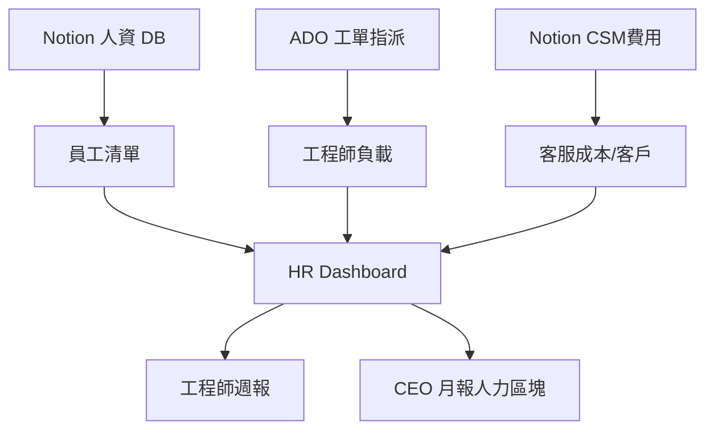

#### F-03 P&L 月報

**資料缺口**：需補充薪資 + 費用資料

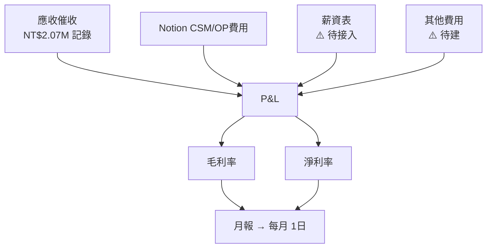

---

### Phase 4：月度策略報告（4月+）

#### M-01 月度 CEO 策略報告（MD 格式）

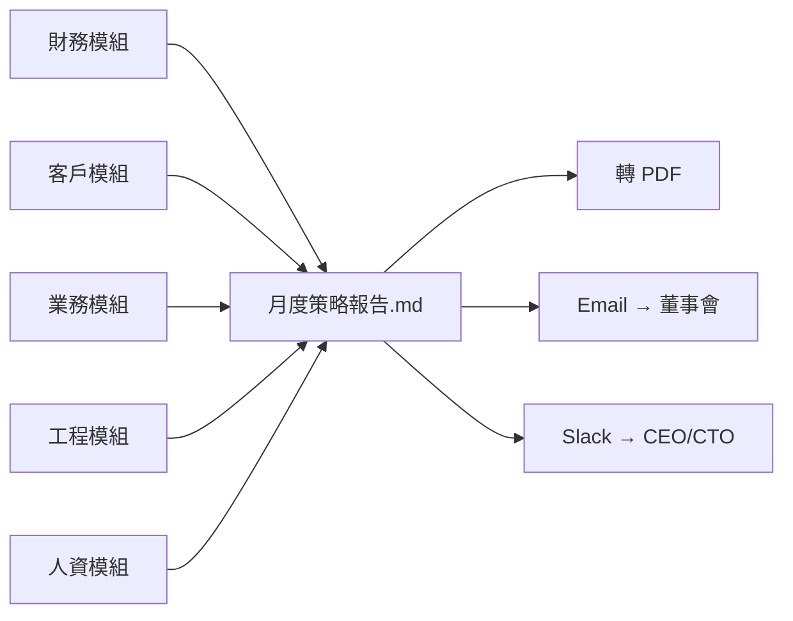

**月報包含：**
1. 一頁摘要（OKR 進度 + 關鍵風險）
2. 財務：P&L / 現金流 / AR 帳齡
3. 業務：銷售管道 / 新客 / 流失
4. 工程：KPI / 技術債 / 可用性
5. 客戶：健康總表 / NPS / SLA
6. 人資：負載 / 招募 / 績效

---

## 五、實作進度追蹤

### 5.1 甘特圖

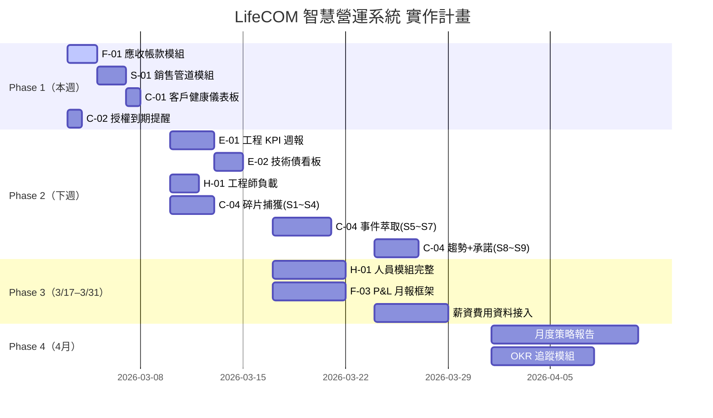

### 5.2 模組狀態

| 模組 | 狀態 | 資料源 | 預計完成 |
|------|------|--------|---------|
| CEO 日報 | ✅ 運行中 | ADO+Slack+Finance | — |
| CTO 日報 | ✅ 運行中 | ADO | — |
| 財務區塊 (立富康) | ✅ 運行中 | Drive xlsx | — |
| **F-01 AR 應收** | 🔧 待建 | 業務文件.xlsx | 3/4 |
| **S-01 銷售管道** | 🔧 待建 | 業務文件.xlsx | 3/5 |
| **C-01 客戶健康** | 🔧 待建 | ADO+Notion+AR | 3/6 |
| **C-02 授權到期** | 🔧 待建 | Notion | 3/3 今日 |
| **C-04 通訊事件智慧層** | 📋 規劃完成 | LINE+Slack+Email → events | 碎片 3/10, 事件 3/17, 趨勢 3/24 |
| D-01 上板部署 Email | ✅ 運行中（每 15 分鐘） | Slack 部署頻道 | — |
| E-01 工程 KPI | ✅ 運行中（每週一、五 08:00） | ADO | — |
| E-02 技術債 | 📋 規劃 | ADO Epic | 3/14 |
| H-01 工程師負載 | 📋 規劃 | ADO | 3/12 |
| F-03 P&L | 📋 規劃 | 多源 | 3/25 |
| M-01 月度報告 | 📋 規劃 | 所有模組 | 4/1 |

---

## 六、立即行動清單

### 今日（2026-03-03）

- [ ] **C-02** 建立 JS/鼎恆/Swarovski Yahoo API 到期 ACT 追蹤
- [ ] **F-01** 開始 `ar_section.js`（業務文件 AR 工作表）
- [ ] **確認** Notion「尚未到款項」是否仍是實際未收（天傳、Relove）

### 本週

- [ ] **S-01** `sales_section.js`（報價單狀態分析 + 未回簽告警）
- [ ] **C-01** `customer_health_section.js`（三維燈號）
- [ ] **整合** 以上模組進 CEO 日報

### 下週

- [ ] 補充 ADO 工程 KPI 計算邏輯
- [ ] 確認薪資/費用資料接入方式（Google Sheets? 或 Notion?）
- [ ] 人資 DB 欄位詳細確認

---

## 七、資料治理原則

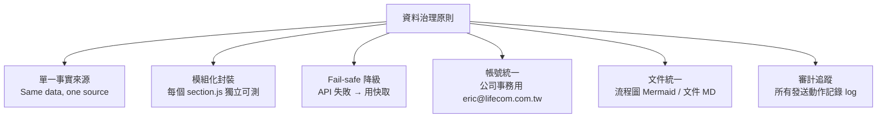

---

*文件路徑：`docs/lifecom-ops-blueprint.md`*
*下次更新：C-04 S1~S3 完成後（預計 2026-03-12）*
