# LifeERPv2（BlackDog）— 完整產品知識庫

> **BlackDog = LifeERPv2**，LifeCOM 核心 OMS/WMS 系統，支撐所有電商代營運客戶的訂單與倉儲管理。
> Repo: `systemLifecom/newblackdog`（Bitbucket）| 本機: `C:\Users\Eric\dev\newblackdog`
> Notion: [BlackDog 產品知識庫](https://www.notion.so/BlackDog-OMS-WMS-31fd2a91c73281bbbb39cec8d5301475) | [架構圖集](https://www.notion.so/Mermaid-31fd2a91c73281129450c42aed3e0902)

---

## 1. 系統總覽

| 項目 | 值 |
|------|-----|
| **正式名稱** | LifeERPv2（代號 BlackDog） |
| **框架** | Laravel 9.x（PHP ^7.3 / ^8.0） |
| **PHP 檔案數** | 1,027 |
| **DB Migrations** | 267 |
| **版本** | v3.10.x |
| **部署** | Docker + Nginx + PHP-FPM（K8s） |
| **認證** | JWT（auth.jwt middleware）+ Laravel Sanctum |

### 資料庫

| Connection | Driver | 用途 |
|-----------|--------|------|
| `lifeerp` | MySQL（default） | OMS 主庫 |
| `bizpro_wms` | MySQL | WMS 倉儲系統 |
| `lifemall` | MySQL | LifeMall 自營商城 |
| `mongodb` | MongoDB | 日誌/非結構化資料 |

---

## 2. 系統架構

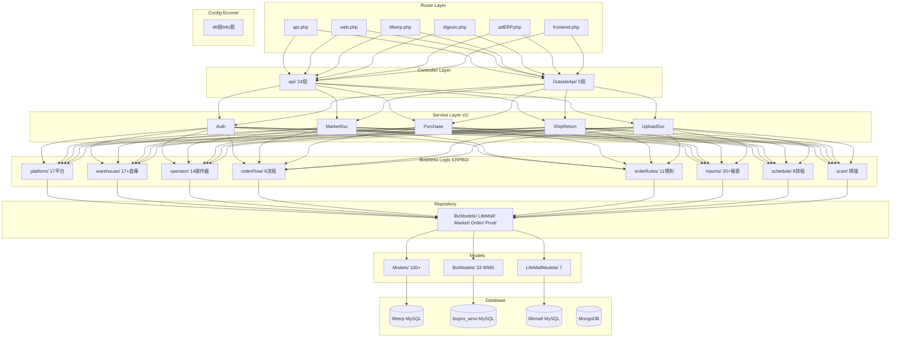

### 目錄結構

| 目錄 | 用途 | 規模 |
|------|------|------|
| `app/Http/Controllers/api/` | 內部 API | 24 Controllers |
| `app/Http/Controllers/OutsideApi/` | 外部 API（Digiwin） | 5 Controllers |
| `app/Services/v1/` | 服務層 | Auth, MarketSvc, Purchase, ShipReturn, UploadSvc |
| `app/Includes/ERPBD/` | 核心業務邏輯 | 250+ 檔案 |
| `app/Includes/Eccore/` | 常量/設定 | 46 Info 類 |
| `app/Models/` | OMS Models | 100+ |
| `app/BizModels/` | WMS Models | 33 |
| `app/Repository/` | Repository 層 | 7 子目錄 |
| `app/Console/Commands/` | Artisan Commands | 19 |
| `app/Jobs/` | Queue Jobs | 7 |

### API Routes

| 檔案 | 用途 |
|------|------|
| `api.php` | 主 API（v1 login, v2 CRUD） |
| `lifeerp.php` | LifeERP 整合 |
| `digiwin.php` | 鼎新 ERP |
| `adERP.php` | adERP |
| `frontend.php` | 前端 |
| `web.php` | SPA + Swagger + 蝦皮 OAuth |

---

## 3. 訂單管理（OMS）

### 訂單狀態機

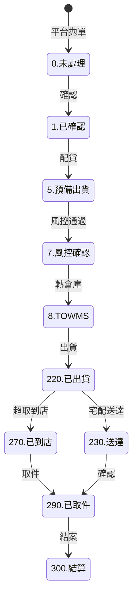

**完整狀態碼：**

| 碼 | 狀態 | 碼 | 狀態 |
|----|------|----|------|
| 0 | 未處理 | 220 | 已出貨 |
| 1 | 已確認 | 230 | 送達消費者 |
| 5 | 預備出貨 | 235 | 部分到達 |
| 6 | 預備出貨# | 260 | 退貨申請 |
| 7 | 風控確認 | 267 | 退貨風控確認 |
| 8 | 已產給倉庫 | 268 | 退貨已產給倉庫 |
| 24 | 訂單取消 | 269 | 等待退款確認 |
| 25 | 暫停出貨 | 270 | 已到店 |
| 38 | 取消中 | 290 | 已取件 |
| 400 | 缺貨等待 | 300 | 結算 |
| 401 | 收件資料異常 | 431 | 平台訂單準備中 |
| 402 | 發票資料異常 | 435 | 平台確認失敗 |
| 403 | 會員資料異常 | 462 | 退貨結案異常 |
| 404 | 黑名單 | 480 | 倉庫回傳異常 |
| 405 | 付款檢核失敗 | 485 | 重新配貨異常 |
| 406 | 付款資料錯誤 | 486 | 倉庫數量異常 |
| 407 | 金額超過風控 | 487 | 退貨入庫異常 |
| 408 | 明細金額異常 | 490 | 發票作廢失敗 |
| 410 | 贈品併單失敗 | 491 | 退款失敗 |
| 420 | 風控訂單規則 | 4111 | 自出門市關轉 |
| 421 | 訂單規則異常 | 4121 | 自出取號失敗 |
| 425 | 出貨風控訂單規則 | | |

### 訂單操作器（operator/）

| Operator | 功能 |
|----------|------|
| `CreateOrder` | 建立訂單 |
| `CreateExchangeOrder` | 建立換貨訂單 |
| `CreateExchangeReturn` | 建立換貨退貨 |
| `PreShipOrder` | 預備出貨 |
| `PreReturnOrder` | 預備退貨 |
| `RefundOrder` | 退款 |
| `ReShipment` / `ReShipmentAfterToWMS` | 重新出貨 |
| `RePackageOrder` | 重新包裝 |
| `SpliteOrder` | 拆單 |
| `ChangeShipMethod` | 變更物流 |
| `ResetToPreShip` / `ResetToPreShipAndDel` | 重設 |
| `CancleOrVoidAssignOrder` | 取消/作廢已配貨 |
| `UpdateOrdersProducts` | 更新訂單商品 |
| `ConfirmRefundOnCreateVirtulProds` | 退款確認 |
| `ResetOrderAndReShipment` | 重設並重出 |

### 訂單規則引擎（orderRules/）

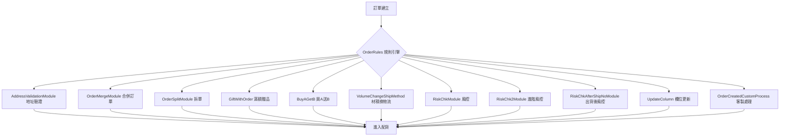

### 訂單流程（OrderFlow）

```mermaid
flowchart TD
    subgraph "DefaultFlow 標準"
        D1[配貨] --> D2[風控] --> D3[取號] --> D4[確認] --> D5[轉WMS] --> D6[出貨]
    end
    subgraph "SFLiiFlow 順豐二倉"
        S1[允許無商品] --> S2[僅寫備註] --> S3[直接轉WMS] --> S4[WMS取號確認]
    end
    subgraph "PostFlow 郵局"
        P1[配貨] --> P2[風控] --> P3[轉WMS] --> P4[取號] --> P5[確認] --> P6[上傳PDF]
    end
    subgraph "NoneAssignFlow 免配貨"
        N1[跳過配貨] --> N2[風控] --> N3[取號] --> N4[轉WMS]
    end
    subgraph "AssignToShipFlow 配貨即出貨"
        A1[配貨] --> A2[風控] --> A3[直接出貨]
    end
    subgraph "ShipCollectFlow 彙總集貨B2B"
        C1[多訂單分組] --> C2[彙總轉WMS] --> C3[集貨出貨]
    end
```

**OrderFlow 配置矩陣：**

| Flow | AssignMode | RiskChkMode | 特性 |
|------|-----------|-------------|------|
| DefaultFlow | NeedAssign | NeedChk | 標準流程 |
| SFLiiFlow | NoneAssign | OnlyMemo | 允許無商品、風控僅備註 |
| PostFlow | NoneAssignV2 | NeedChk | 不配但更新ID、需上傳PDF |
| NoneAssignFlow | NoneAssign | NeedChk | 跳過配貨 |
| AssignToShipFlow | AssignToShip | NeedChk | 配貨完直接出貨 |
| ShipCollectFlow | NeedAssign | NeedChk | B2B 彙總集貨 |

---

## 4. 倉儲管理（WMS）

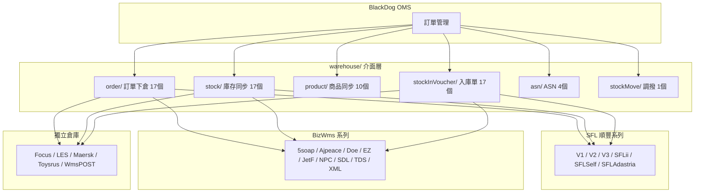

### BizModels（WMS DB bizpro_wms）

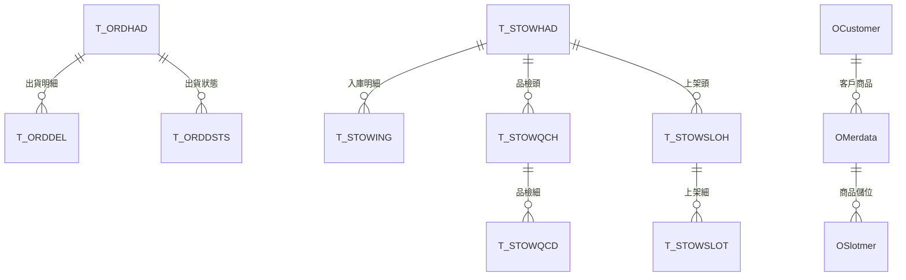

---

## 5. 電商平台串接（17 平台）

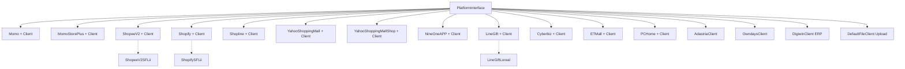

**架構模式**：`平台.php`（業務邏輯）+ `平台Client.php`（API 呼叫），統一實作 `PlatformInterface.php`。

**市場類型（MarketsInfo）**：Upload, DigiwinApi, YahooMall, Yahoo, Shopline, MOMO, MOMO_STORE_PLUS, LifeMall, Shopee, XMLFILE, Cyberbiz, Shopify, YSMS, Upload_ds, ETMall, LineGift, PCHome, Upload_b2b

### 資料流

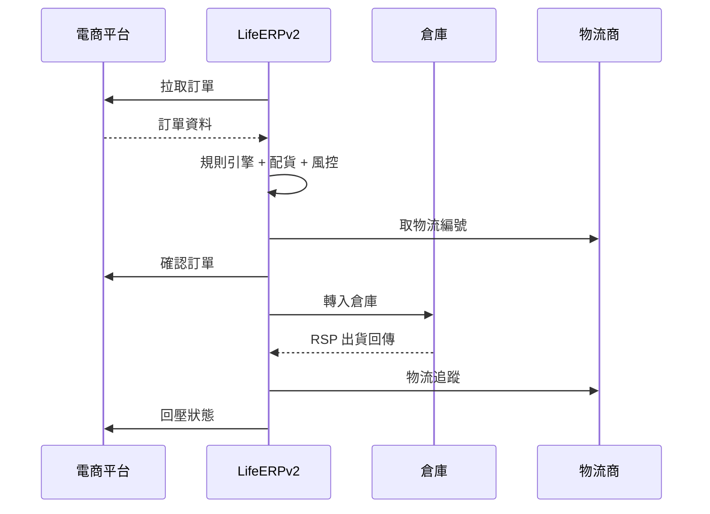

---

## 6. ERP 整合

| 系統 | 檔案 | 用途 |
|------|------|------|
| **Digiwin 鼎新** | `digiwin/DigiwinBase.php` + routes | 訂單下推、採購同步 |
| **LifeERP** | `lifeerp/LifeERPApi.php` + routes | 退貨資料、訂單設定 |
| **SAP** | `libraries/Sap.php` | Levis SAP 整合 |
| **Siebel** | `libraries/Siebel.php` | CRM 會員 |
| **Cetustek** | `libraries/einv/Cetustek.php` | 電子發票（關貿） |
| **NewebPay** | `libraries/payments/newebpay/` | 藍新金流 |
| **LifeTMS** | `logistics/LifeTMSApi*.php` | 物流 TMS |

---

## 7. 物流出貨

### 物流方式分類

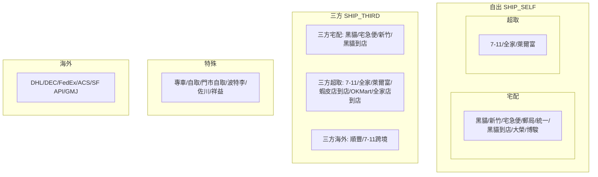

### PDF 列印

| 物流商 | PDF 類 |
|--------|--------|
| 黑貓 | TCat3ModePDF, TCatPackPDF |
| 新竹 | HctPackPDF |
| 7-11 | SevenPDF6, Seven1015 |
| 全家 | NineOneFamilyPDF |
| 萊爾富 | HilifePDF |
| 郵局 | PostPDF |
| 宅急便 | Pelican1Of3 |
| 中華郵政 | ChunghwaPostShipPDF |
| 門市 | Store1015 |
| 自出 | BaseSelfShipPDF |

---

## 8. 排程任務

### 動態排程架構

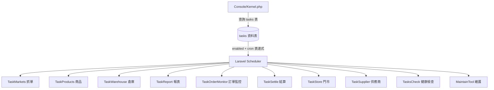

排程從 `tasks` 資料表**動態載入**，非硬編碼。每個 task 有 cron 表達式 + `runInBackground` + `withoutOverlapping`。

### Schedule Process

| Process | 功能 |
|---------|------|
| `MarketsProcess` | 各平台訂單抓取 |
| `PreShipOrdersProcess` | 預備出貨處理 |
| `ProductsProcess` | 商品同步 |
| `ReportsProcess` | 報表產生 |
| `StoreProcess` | 門市同步 |
| `SupplierProcess` | 供應商 |
| `WarehouseProcess` | 倉庫 |
| `CustNoProcess` | WMS 客戶編號 |

---

## 9. 風控引擎

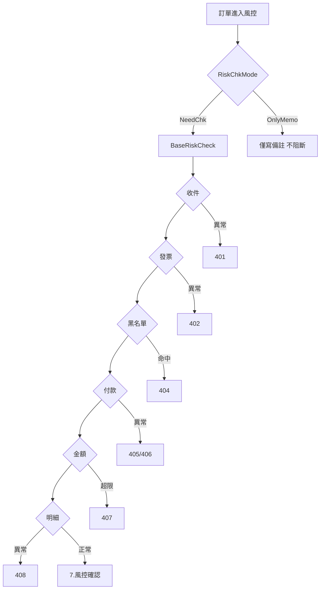

**客戶專用風控：** `BaseRiskCheckLoreal`（萊雅）、`RefundRiskCheck`（退款）

---

## 10. 報表系統（reports/）

所有報表實作 `ReportInterface`，繼承 `AbstractReport`。

| 報表 | 客戶 | 報表 | 客戶 |
|------|------|------|------|
| OrderSales | 通用 | LevisSapSales | Levis |
| EmersSales | Emers | JealousnessSales | Jealousness |
| JollywizSales | Jollywiz | ChingHwaSales | 慶華 |
| DhinChiSales | 鼎基 | FivesoapSales | 五皂 |
| PSKSales | PSK | SWASales | SWA |
| TeamsonSales | Teamson | ToysrusSales | Toysrus |
| UmbrellaKingSales | 雨傘王 | SysCompareStocks | 系統 |
| SysLowStocks | 系統 | SysBDReport | 系統 |

---

## 11. 退貨/換貨流程

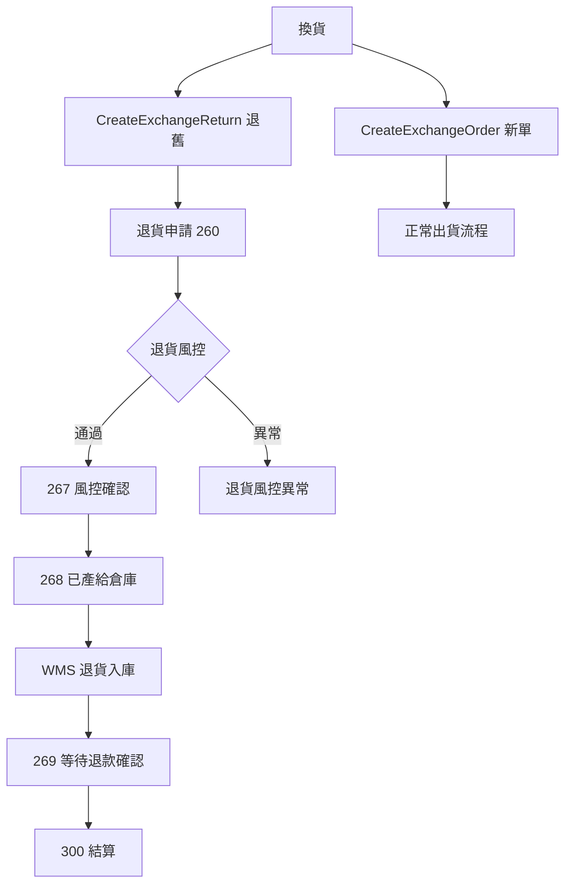

### 交易類型（trade_id）

| 銷售類 | 退貨類 | 特殊類 |
|--------|--------|--------|
| 1.一般 | 9.退貨 | 3.瑕疵 |
| 2.員工 | 10.物退 | 4.借出 |
| 5.調撥 | 15.換退 | 21.門市進貨 |
| 6.其他 | 16.門市退 | 22.轉倉 |
| 7.業務 | 17.宅退 | 61.新品 |
| 8.換貨新單 | 42.平台換退 | 71.退倉 |
| 11.拆單 | | 81.轉倉出貨 |
| 14.重出 | | 100.門市銷售 |
| 41.平台換貨 | | |

---

## 12. 客戶專屬模組

### Eccore Info 類（多租戶差異化）

| Info 類 | 客戶 | 專屬模組 |
|---------|------|----------|
| AdastriaInfo | Adastria | SIV, 倉儲, 庫存 |
| LevisInfo | Levis | RSP, SAP銷售, STKR |
| OwndaysInfo | OWNDAYS | 採購, POS |
| SabonInfo | Sabon | RSP |
| NPCInfo | NPC | 倉儲 |
| NSYInfo | NSY | 出貨標籤 |
| UCCInfo | UCC | 商品, 門市 |

### 客戶對照表

| 客戶 | 平台 | 專用模組 |
|------|------|----------|
| Levis | SAP | RSP, SAP銷售, STKR |
| Adastria | 專用 | SIV, 庫存, 倉儲 |
| OWNDAYS | POS | 採購, 庫存 |
| Doe | Digiwin | 採購, 倉儲 |
| L'Oréal | LINE Gift | 風控, 發票 |
| UCC | 專用 | 商品, 門市 |
| SWA | 專用 | 銷售, ASN |
| Toysrus | 專用 | 銷售, 倉儲 |
| Shimamura | 專用 | 採購, 入庫 |
| fmshoes | 專用 | Docker 獨立部署 |

---

## 13. 檔案交換

| 格式 | Library |
|------|---------|
| CSV | `libraries/CSV.php` |
| XML | `XML.php`, `XMLMaker.php`, `XMLTBC.php`, `XMLDKSH.php` |
| TXT | `libraries/TXT.php` |
| Excel | `SpoutExcel.php`（box/spout） |
| FTP/SFTP | `FTPS.php`, `FilesExchange.php` |

---

## 14. Observer / Webhook 事件

| Observer | 監控 |
|----------|------|
| OrdersProductsEvent | 訂單商品變更 |
| ProductsEvent / ProductsStockEvent | 商品/庫存 |
| PurchaseEvent / PurchaseHeaderEvent | 採購 |
| StockInHeader/BodyEvent | 入庫 |
| StockMovementEvent | 調撥 |
| T_ORDHADEvent | WMS 出貨單 |

Webhook: `OrdersWebhook` / `PurchaseHeaderWebhook` → 客戶系統

---

## 15. 已知持續問題

| 問題 | 來源 | 嚴重度 |
|------|------|--------|
| MomoClient.php null array | platform/MomoClient | 中 |
| Momo 節假日 SSL reset | platform/Momo | 低 |
| TOWMS airbu2 not_mapping_ORDTY | warehouse/ | 中 |
| TOWMS vacanza IMSSP | warehouse/ | 中 |
| levis Invalid CRON | schedule/ | 低 |
| sfl Route[login] 週期性爆發 | warehouse/BizWmsSFL | 中 |

---

## 16. 關鍵依賴

| 套件 | 用途 |
|------|------|
| `laravel/framework ^9.0` | 核心 |
| `guzzlehttp/guzzle ^7.0` | HTTP |
| `box/spout ^3.3` | Excel |
| `barryvdh/laravel-dompdf ^2.0` | PDF |
| `spatie/laravel-webhook-server ^3.8` | Webhook |
| `league/flysystem-aws-s3-v3 ^3.0` | S3 |
| `awobaz/compoships ^2.1` | 複合主鍵 |

---

## 17. 安全性

- JWT 認證（auth.jwt middleware）
- Webhook 簽名驗證
- 資料加密（EncyptModels/ + libraries/decrypt/）
- 風控引擎（BaseRiskCheck 系列）
- 客戶黑名單（CustomersBlacklist）
- Google reCAPTCHA V3

---

## 18. 新架構方向：BlackDog → 純 API 引擎（2026-03-11 定案）

> **核心決策**：將 BlackDog 推回純 API 引擎，前台框架完全解耦。
> 現有 React SPA 不廢棄，作為第一個 API consumer 持續利用。

### 架構演進概念

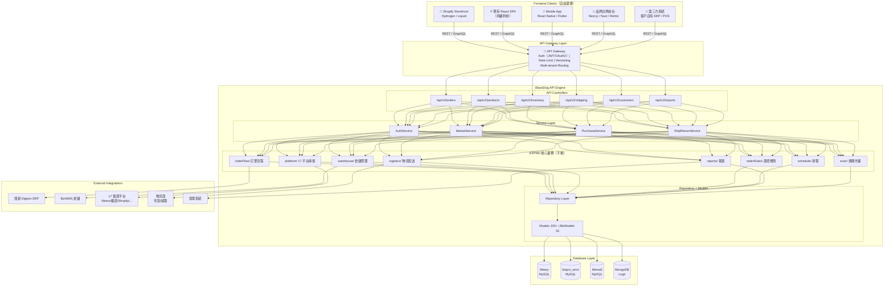

### 現狀 vs 新架構對照

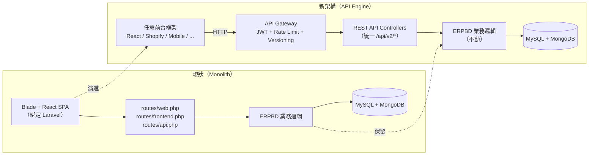

### 遷移要點

| 項目 | 說明 |
|------|------|
| **ERPBD 層** | 不動。36 個模組 + 250 檔案是核心價值 |
| **現有 React SPA** | 保留，改打標準 API endpoint（第一個 consumer） |
| **Blade Templates** | 逐步淘汰，業務邏輯下沉到 ERPBD |
| **認證** | 已有 JWT（auth.jwt），擴充 OAuth2 for 第三方 |
| **API 版本** | 統一 `/api/v2/*`，未來 v3 不破壞 v2 |
| **routes/frontend.php** | 邏輯提取到 Service Layer，路由廢棄 |
| **routes/web.php** | 僅保留 OAuth callback / Swagger |
| **Multi-tenant** | 現有 Eccore/ 46 Info 類已支援，API Gateway 層統一路由 |

### 前台選型自由度

| 場景 | 推薦方案 | 理由 |
|------|---------|------|
| 品牌官網 | Shopify Hydrogen / Storefront API | Shopify 生態，SEO 友善 |
| LifeCOM 自營後台 | 現有 React SPA（漸進升級） | 最低成本，已存在 |
| Mobile App | React Native | 前端團隊技術棧一致 |
| 品牌白牌 | Next.js / Remix | SSR + 高自訂 |
| B2B 整合 | 純 API（無前台） | Digiwin/客戶 ERP 直串 |

---

## Notion 連結

- [產品知識庫主頁](https://www.notion.so/BlackDog-OMS-WMS-31fd2a91c73281bbbb39cec8d5301475)
- [架構圖集（Mermaid）](https://www.notion.so/Mermaid-31fd2a91c73281129450c42aed3e0902)
